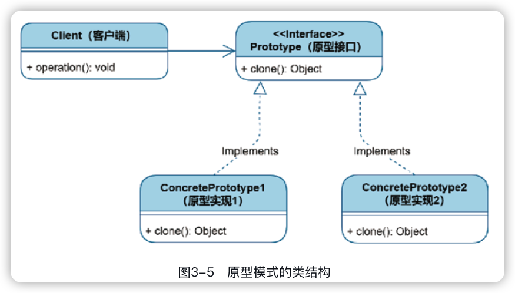
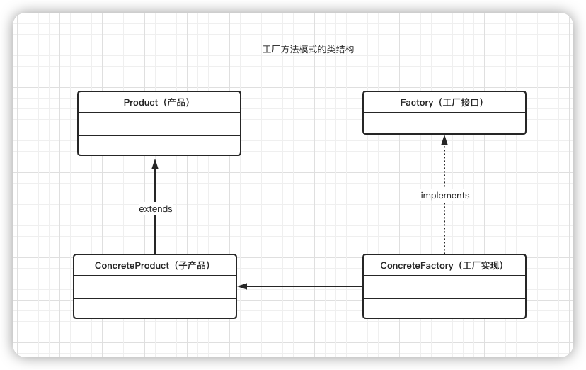
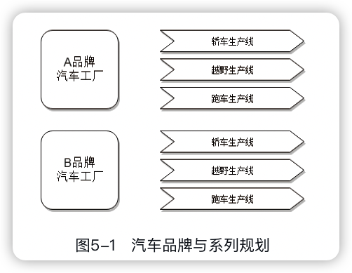
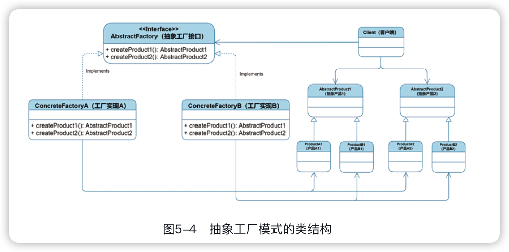

秒懂设计模式
-----


## 1 初探

从某种意义上讲，设计模式并不是指某种具体的技术，而更像是一种思想，一种格局。

为了将现实世界重现于计算机世界中，我们想了各种方法针对这些对象建立数字模型。

### 1.1 封装

现实中封装的例子：

- 胶囊对于各类混合药物的封装。

- 钱包对于现金、身份证及银行卡的封装。
- 计算机主机机箱对于主板、CPU及内存等配件的封装等。
- 饮料是被装在杯子里。**零散的数据缺乏集中管理，难以引用、读取**。封装后的可乐更加干净、卫生，可以防止外部的灰尘落入，杯子里面以关键字“private”声明的可乐会成为内部的私有化对象，因此能防止外部随意访问，避免造成数据污染。对外暴露的吸管接口带来了极大便利，顾客在喝可乐时根本不需要关心杯子的内部对象和工作机制，如杯子中的冰块如何让可乐降温、杯体内部的气压如何变化、气压差又是如何导致可乐流出等实现细节对顾客完全是不可见的，留给顾客的操作其实非常简单，只需调用“吸”这个公有方法就可以喝到冰爽的可乐了。

- 弹药-》子弹-》弹夹


封装就是随着时间的推移对前人经验和技术产物的逐渐堆叠和组合的结果。

### 1.2　继承

从某种意义上讲，如果说类是对象的模板，那么父类（或超类）则可以被看作模板的模板。


### 1.3 多态

对于父类定义的引用只能指向本类或者其子类实例化而来的对象，这就是一种多态。

多态其实是利用了继承（或接口实现）这个特性体现出来的另一番景象。

### 1.4　计算机与外设

模块化

通过对计算机接口的抽象化、标准化，我们对各个模块重新分类、规划，并合理封装，最终实现计算机与外设的彻底解耦。

# 创建篇

## 2 单例（Singleton）


### 2.2 饿汉造日

```java
public class Sun {
  private static final Sun sun = new Sun();
  private Sun() {  // 构造方法私有化
    
  }
  public static Sun getInstance() {
    return sun;
  }
}
```

通过一个public的静态方法Sun.getInstance()获得太阳对象实例，并且这个实例在内存中只有一个。

**“饿汉模式”（eagerinitialization）**，即在初始阶段就主动进行实例化，并时刻保持一种渴求的状态，无论此单例是否有人使用。

### 2.3 懒汉模式

饿汉模式不管太阳有没有使用，都造出来了，**懒汉模式（lazy initialization）**是在太阳需要使用时再造出来。

```java
1.  public class Sun {
2.  
3.      private static Sun sun;//这里不进行实例化
4.  
5.      private Sun(){//构造方法私有化
6.      
7.      }
8.  
9.      public static Sun getInstance() {
10.         if (sun == null) {//如果无日才造日
11.             sun = new Sun();
12.         }
13.         return sun;
14.     }
15.  
16. }
```

上面的情况在多线程模式下有缺陷。如果是并发请求的话，程序第10行的判空逻辑就会同时成立，这样就会多次实例化太阳，并且对sun进行多次赋值（覆盖）操作，这违背了单例的理念。改进一下：

```java
1.  public class Sun {
2.  
3.      private volatile static Sun sun;
4.  
5.      private Sun(){//构造方法私有化
6.      
7.      } 
8.  
9.      public static Sun getInstance() {//华山入口
10.         if (sun == null) {//观日台入口
11.             synchronized(Sun.class){//观日者进行排队
12.                if (sun == null) {
13.                    sun = new Sun();//只有排头兵造了太阳，旭日东升
14.                }
15.             }
16.         }
17.         return sun; //……阳光普照，其余人不必再造日
18.     }
19. }
```

 volatile对静态变量的修饰则能保证变量值在各线程访问时的同步性、唯一性。

用了2个嵌套的判空逻辑，这就是懒加载模式的“双检锁”：外层放宽入口，保证线程并发的高效性；内层加锁同步，保证实例化的单次运行。

### 2.4　大道至简

大部分情况，还是使用“饿汉模式”。

越简单的包容性越强，而越复杂的反而越容易出错。

单例模式还又其它实现方式，但都是由这2种模式发展、衍生而来的。

## 3 原型（Prototype）

在制造业中通常是指大批量生产开始之前研发出的概念模型，并基于各种参数指标对其进行检验，如果达到了质量要求，即可参照这个原型进行批量生产。

原型模式达到以原型实例创建副本实例的目的即可，并不需要知道其原始类，也就是说，原型模式可以<font color=#FF8C00>**用对象创建对象**</font>，而不是用类创建对象，以此达到效率的提升。

打印： 原型

复印：副本

### 卡顿的游戏

原型模式的目的是从原型实例克隆出新的实例，对于那些有非常复杂的初始化过程的对象或者是需要耗费大量资源的情况，原型模式是更好的选择。

```java
public class EnemyPlane {
    private int x;
    private int y = 0;

    public EnemyPlane(int x) {
        this.x = x;
    }

    public int getX() {
        return x;
    }

    public int getY() {
        return y;
    }

    public void fly() {
        y++;
    }
}
```

```java
public class Client {
    public static void main(String[] args) {
        ArrayList<EnemyPlane> enemyPlanes = new ArrayList<>();
        for (int i = 0; i < 500; i++) {
            EnemyPlane ep = new EnemyPlane(new Random().nextInt(200));
            enemyPlanes.add(ep);
        }
    }
}
```

问题一：游戏的加载阶段我们就实例化了这一关卡的所有500架敌机。

解决：通过懒加载，按照地图坐标，屏幕滚动到某一点时才实时构造敌机。

问题二：每架敌机都使用new进行全新构造，如果是大量的类构造与复杂的初始化工作，会消耗大量CPU资源。

解决：实现java.lang包中的克隆接口Cloneable，这样外部就能够对本类的实例进行克隆操作了，省去了由类而生的再造过程。

```java
public class EnemyPlane implements Cloneable{
    
    // ...
      
    // 此处开发setX，是为了让克隆后的实例重新修改横坐标
    public void setX(int x) {
        this.x = x;
    }

    @Override
    protected Object clone() throws CloneNotSupportedException {
        return (EnemyPlane) super.clone();
    }
}
```

### 克隆工厂

```java
public class EnemyPlaneFactory {
    // 用单例饿汉模式造一个敌机原型
    private static EnemyPlane protoType = new EnemyPlane(200);

    // 获取敌机克隆实例
    public static EnemyPlane getInstance(int x) throws CloneNotSupportedException {
        EnemyPlane clone = protoType.clone();
        clone.setX(x);
        return clone;
    }
}
```

### 浅拷贝和深拷贝

```java
public class EnemyPlane implements Cloneable{
    private int x;
    private int y = 0;
    private Bullet bullet = new Bullet();

		// ...
}
```

**浅拷贝**是指只复制原始类型的值，比如横坐标x与纵坐标y这种以原始类型int定义的值，它们会被复制到新克隆出的对象中。而引用类型bullet同样会被拷贝，但是请注意这个操作只是拷贝了地址引用（指针），也就是说副本敌机与原型敌机中的子弹是同一颗，因为两个同样的地址实际指向的内存对象是同一个bullet对象。

克隆方法中调用父类Object的clone方法进行的是浅拷贝。

```java
    @Override
    protected EnemyPlane clone() throws CloneNotSupportedException {
        // 克隆出敌机
        EnemyPlane clonePlane = (EnemyPlane) super.clone();
        // 对子弹进行深拷贝
        clonePlane.setBullet(this.bullet.clone());

        return clonePlane;
    }
```

### 克隆的本质



- Prototype（原型接口）：声明克隆方法，对应Cloneable接口。
- ConcretePrototype（原型实现）：原型接口的实现类，实现方法中调用super.clone()即可得到新克隆的对象。
- Client（客户端）：客户端只需调用实现此接口的原型对象方法clone()，便可轻松地得到一个全新的实例对象。

从类到对象叫作“**创建**”，而由本体对象至副本对象则叫作“**克隆**”。

究其本质，克隆操作时Java虚拟机会进行**内存操作**，直接拷贝原型对象数据流生成新的副本对象，绝不会拖泥带水地触发一些多余的复杂操作（如类加载、实例化、初始化等）。


## 4 工厂方法（Factory Method）

程序设计中的工厂类往往是**对对象构造、实例化、初始化过程的封装**，而工厂方法（FactoryMethod）则可以升华为一种设计模式，它对工厂制造方法进行**接口规范化**，以允许子类工厂决定具体制造哪类产品的实例，最终降低系统耦合，使系统的可维护性、可扩展性等得到提升。


传统构造，要制造产品（实例化对象）使用new，如`Plane plane = new Plane()`，其中可能还包括一些复杂的初始化代码，这样会使**客户端与实例化过程强耦合**。


### 劳动分工

与其把所有生产方式堆积在一个简单工厂类中，不如把生产方式放在具体的子类工厂中去实现，这样做对工厂的抽象化与多态化有诸多好处，避免了由于新加入产品类而反复修改同一个工厂类所带来的困扰，使后期的代码维护以及扩展更加直观、方便。



工厂方法模式的各角色：

- Product（产品）：所有产品的顶级父类，可以是抽象类或者接口。对应本章例程中的敌人抽象类。
- ConcreteProduct（子产品）：由产品类Product派生出的产品子类，可以有多个产品子类。对应本章例程中的飞机类、坦克类以及关底Boss类。
- Factory（工厂接口）：定义工厂方法的工厂接口，当然也可以是抽象类，它使顶级工厂制造方法抽象化、标准统一化。
- ConcreteFactory（工厂实现）：实现了工厂接口的工厂实现类，并决定工厂方法中具体返回哪种产品子类的实例。


## 5 抽象工厂（Abstract Factory）

抽象工厂模式（Abstract Factory）是**对工厂的抽象化，而不只是制造方法**。

将各种产品分门别类，基于此来规划各种工厂的制造接口，最终确立产品制造的顶级规范，使其与具体产品彻底脱钩。

抽象工厂是建立在制造复杂产品体系需求基础之上的，可以理解为工厂方法模式的高度集群化升级版。




### 5.4 分而治之

与工厂方法模式不同，抽象工厂模式能够应对更加复杂的产品族系，它更类似于一种对“工业制造标准”的制定与推行，各工厂实现都遵循此标准来进行生产活动，以工厂类划分产品族，以制造方法划分产品系列，达到无限扩展产品的目的。



- AbstractProduct1、AbstractProduct2（抽象产品1、抽象产品2）：产品系列的抽象类，图中一系产品与二系产品分别代表同一产品族的多个产品系列，对应本章例程中的初级、中级、高级兵种抽象类。
- ProductA1、ProductB1、ProductA2、ProductB2（产品A1、产品B1、产品A2、产品B2）：继承自抽象产品的产品实体类，其中ProductA1与ProductB1代表A族产品与B族产品的同一产品系列，类似于本章例程中人类族与外星怪兽族的初级兵种，之后的产品实体类以此类推。
- AbstractFactory（抽象工厂接口）：各族工厂的高层抽象，可以是接口或者抽象类。抽象工厂对各产品系列的制造标准进行规范化定义，但具体返回哪个族的产品由具体族工厂决定，它并不关心。
- ConcreteFactoryA、ConcreteFactoryB（工厂A实现、工厂B实现）：继承自抽象工厂的各族工厂，需实现抽象工厂所定义的产品系列制造方法，可以扩展多个工厂实现。对应本章例程中的人类兵工厂与外星母巢。
- Client（客户端）：产品的使用者，只关心制造出的产品系列，具体是哪个产品族由工厂决定。

抽象工厂模式一定是基于产品的族系划分来布局的，其产品系列一定是相对固定的，故以抽象工厂来确立工业制造标准（各产品系列生产接口）。

## 6 建造者（Builder）

建造者模式（Builder）所构建的对象一定是庞大而复杂的，并且一定是按照既定的制造工序将组件组装起来的。

又称为生成器模式，主要用于**对复杂对象的构建、初始化**，它可以将多个简单的组件对象按顺序一步步组装起来，最终构建成一个复杂的成品对象。

区别于工厂系列模式，建造者模式的主要目的在于<u>把烦琐的构建过程从不同对象中抽离出来，使其脱离并独立于产品类与工厂类，最终实现用同一套标准的制造工序能够产出不同的产品</u>。

### 6.5 工艺与工序

施工方接口对施工标准的抽象化、标准化使建造者（施工方）的建造质量达到既定要求，且使各建造者的建造“工艺”能够个性化、多态化。

工程总监将工作流程抽离出来独立于建造者，使建造“工序”得到统一把控。


- Product（产品）：复杂的产品类，构建过程相对复杂，需要其他组件组装而成。对应本章例程中的建筑物类。
- Builder（建造者）：建造者接口，定义了构成产品的各个组件的构建标准，通常有多个步骤。对应本章例程中的施工方接口。
- ConcreteBuilder（建造者实现）：具体的建造者实现类，可以有多种实现，负责产品的组装但不包含整体建造逻辑。对应本章例程中的别墅施工方类与多层公寓施工方类。
- Director（指导者）：持有建造者接口引用的指导者类，指导建造者按一定的逻辑进行建造。对应本章例程中的工程总监类


# 结构篇

## 7 门面（Facade）

将多个不同的子系统接口封装起来，并对外提供统一的高层接口，使复杂的子系统变得更易使用。

无论是“门”还是“面”，指代的都是<u>某系统的外观部分，也就是与外界接触的临界面或接口</u>，所以门面模式常常也被翻译为“**外观模式**”。


## 8 组合（Composite）

组合模式（Composite）是针对由多个节点对象（部分）组成的树形结构的对象（整体）而发展出的一种结构型设计模式。


## 9 装饰器（Decorator）

装饰器模式（Decorator）能够**在运行时动态地为原始对象增加一些额外的功能**，使其变得更加强大。

装饰器类似“继承”，区别：继承在编译时（compile-time）静态地通过对原始类的继承完成；装饰器则是在程序运行时（run-time）通过对原始对象动态地“包装”完成，是对类实例（对象）“装饰”的结果。


## 10 适配器（Adapter）

当一个对象或类的接口不能匹配用户所期待的接口时，适配器就充当中间转换的角色，以达到兼容用户接口的目的，同时适配器也实现了客户端与接口的解耦，提高了组件的可复用性。


## 11 享元（Flyweight）

元，始也，有本初、根源的意思。“享元”则是共享元件的意思。

享元模式的英文flyweight是轻量级的意思，这就意味着享元模式能使程序变得更加**轻量化**。当系统存在大量的对象，并且这些对象又具有相同的内部状态时，我们就可以用享元模式共享相同的元件对象，以避免对象泛滥造成资源浪费。

## 12 代理（Proxy）

代理方以业务对象的名义，代理了它的业务。

## 13 桥接（Bridge）

桥接模式（Bridge）能将抽象与实现分离，使二者可以各自单独变化而不受对方约束，使用时再将它们组合起来。

# 行为篇

## 14 模板方法（Template Method）

模板是对多种事物的结构、形式、行为的**模式化**总结，而模板方法模式（Template Method）则是**对一系列类行为（方法）的模式化**。

## 15 迭代器（Iterator）

迭代，在程序中特指对某集合中各元素逐个取用的行为。

迭代器模式（Iterator）提供了一种机制来按顺序访问集合中的各元素，而不需要知道集合内部的构造。


## 16 责任链（Chain of Responsibility）

在软件系统中，<u>当一个业务需要经历一系列业务对象去处理时</u>，我们可以把这些业务对象串联起来成为一条业务责任链，请求者可以直接通过访问业务责任链来完成业务的处理，最终实现请求者与响应者的解耦。


## 17 策略（Strategy）

略模式（Strategy）强调的是**行为的灵活切换**，比如一个类的多个方法有着类似的行为接口，可以将它们抽离出来作为一系列策略类，在运行时灵活对接，变更其算法策略，以适应不同的场景。


## 18 状态（State）

状态指**事物基于所处的状况、形态表现出的不同的行为特性**。状态模式（State）构架出一套完备的**事物内部状态转换机制**，并将内部状态包裹起来且对外部不可见，使其行为能随其状态的改变而改变，同时简化了事物的复杂的状态变化逻辑。


## 19 备忘录（Memento）

备忘录用来记录曾经发生过的事情，使回溯历史变得切实可行。备忘录模式（Memento）则可以**在不破坏元对象封装性的前提下捕获其在某些时刻的内部状态，并像历史快照一样将它们保留在元对象之外，以备恢复之用**。


## 20 中介（Mediator）

中介是在事物之间传播信息的中间媒介。中介模式（Mediator）为对象构架出一个互动平台，通过减少对象间的依赖程度以达到解耦的目的。


## 21 命令（Command）

命令是**一个对象向另一个或多个对象发送的指令信息**。命令的发送方负责下达指令，接收方则根据命令触发相应的行为。作为一种数据（指令信息）驱动的行为型设计模式，命令模式（Command）能够**将指令信息封装成一个对象，并将此对象作为参数发送给接收方去执行，以使命令的请求方与执行方解耦，双方只通过传递各种命令过象来完成任务**。此外，命令模式还支持命令的批量执行、顺序执行以及命令的反执行等操作。


## 22 访问者（Visitor）

访问者模式（Visitor）主要解决的是数据与算法的耦合问题，尤其是在数据结构比较稳定，而算法多变的情况下。


## 23 观察者（Observer）

观察者模式（Observer）可以针对被观察对象与观察者对象之间一对多的依赖关系建立起一种行为自动触发机制，当被观察对象状态发生变化时主动对外发起广播，以通知所有观察者做出响应。

## 24 解释器Interpreter）

解释器模式（Interpreter）会针对某种语言并基于其语法特征创建一系列的表达式类（包括终极表达式与非终极表达式），利用树结构模式将表达式对象组装起来，最终将其翻译成计算机能够识别并执行的语义树。


## 25 
