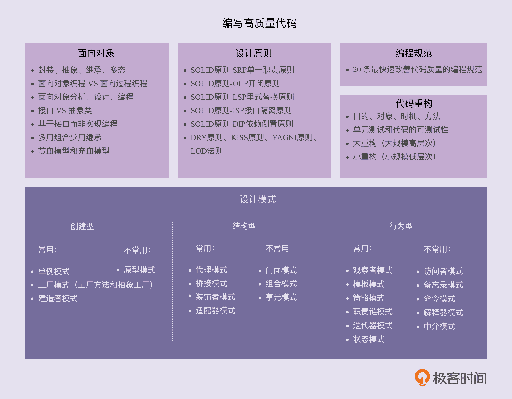

# 《设计模式之美》笔记

专栏[设计模式之美](https://time.geekbang.org/column/intro/250)的笔记。

## 专栏介绍

以 23 种设计模式为核心，从面向对象、设计原则、编程规范、代码重构铺开，追本溯源，通过200多个实战案例，一次性全面掌握编写高质量代码的所有知识。

## 目录

[一、设计模式学习导读](sjmszm-01.md)

[二、设计原则与思想：面向对象](sjmszm-02.md)

[三、设计原则与思想：设计原则](sjmszm-03.md)

[四、设计原则与思想：规范和重构](sjmszm-04.md)

[五、设计原则与思想：总结](sjmszm-05.md)

[六、设计模式与范式：创建型](sjmszm-06.md)

[七、设计模式与范式：结构型](sjmszm-07.md)

[八、设计模式与范式：行为型](sjmszm-08.md)

[九、设计模式与范式：总结](sjmszm-02.md)

十、开源实战

十一、项目实战

加餐

高质量的代码

如何将这些理论灵活恰当地应用到实际的开发中，而不是教条主义和盲目滥用。